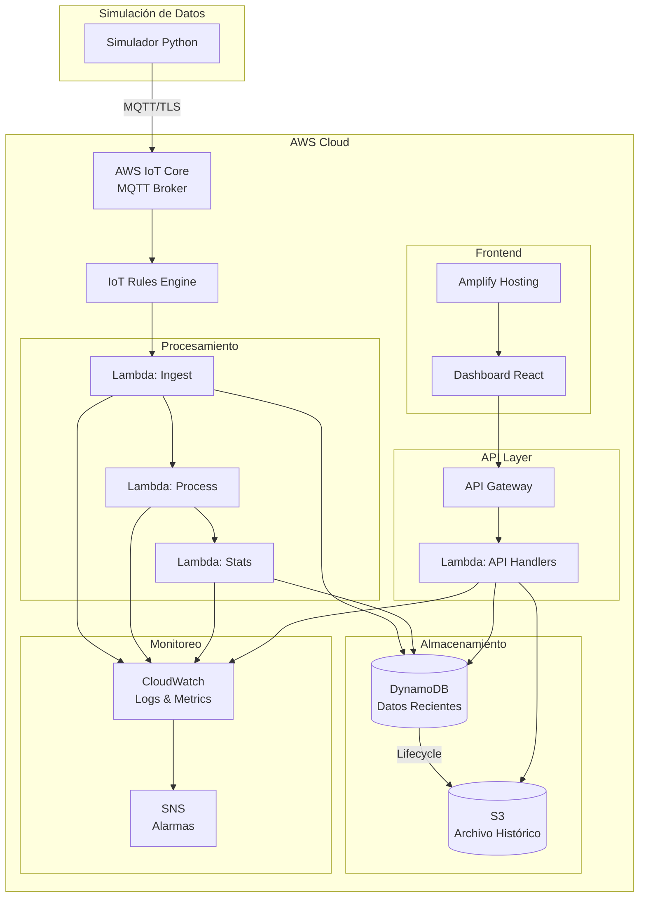

# Diseño: Prototipo IoT Paint Shop KIA

## Overview

Este documento describe el diseño técnico de un prototipo de sistema IoT para digitalizar y monitorear variables del proceso de pintura (Paint Shop) de KIA. El prototipo está diseñado como una **demostración acelerada** con restricciones estrictas de costo y la capacidad de ser completamente eliminado sin dejar cargos residuales.

### Objetivos del Prototipo

1. **Demostración de capacidades**: Mostrar la viabilidad de digitalización del paint shop usando AWS
2. **Costo controlado**: Mantener costos mensuales bajo $50 USD
3. **Infraestructura efímera**: Permitir creación y destrucción completa del entorno
4. **Escalabilidad demostrable**: Probar con ~100 variables (subset del sistema completo de 130+)

### Alcance

- **Variables monitoreadas**: ~100 variables de proceso
  - Pre-Treatment (PT): 48 variables
  - E-Coat (ED): 18 variables
  - Production Control: 34 variables
- **Frecuencia de muestreo**: 30 segundos
- **Retención de datos**: 30 días (DynamoDB) + 90 días (S3 archivado)
- **Usuarios concurrentes**: <10

### Restricciones Críticas

1. **Presupuesto**: <$50/mes (pagado personalmente por el usuario)
2. **Servicios permitidos**: Solo aquellos con capa gratuita generosa o costos mínimos
3. **Servicios prohibidos**: IoT SiteWise, QuickSight, Timestream, SageMaker, RDS/Aurora
4. **Eliminación completa**: Toda la infraestructura debe poder eliminarse sin cargos residuales

---

## Architecture

### Arquitectura General

El sistema sigue una arquitectura serverless basada en eventos, optimizada para minimizar costos mientras mantiene capacidades de demostración efectivas.



### Flujo de Datos

1. **Ingesta**:
   - Simulador Python genera datos de 100 variables cada 30 segundos
   - Publica mensajes MQTT a AWS IoT Core usando certificados X.509
   - Topics estructurados: `kia/paintshop/{area}/{variable_id}`

2. **Procesamiento**:
   - IoT Rules Engine enruta mensajes a Lambda de ingesta
   - Lambda valida, enriquece y almacena en DynamoDB
   - Lambda de procesamiento calcula estadísticas y detecta anomalías
   - Alarmas se generan y almacenan cuando se exceden umbrales

3. **Almacenamiento**:
   - DynamoDB almacena datos recientes (30 días con TTL)
   - S3 almacena archivos históricos en formato Parquet comprimido
   - Lifecycle policies eliminan datos antiguos automáticamente

4. **Consulta y Visualización**:
   - Dashboard React consulta API Gateway
   - Lambdas de API consultan DynamoDB/S3
   - Visualizaciones en tiempo real con auto-refresh cada 30s

### Decisiones de Arquitectura

| Decisión | Alternativas Consideradas | Justificación |
|----------|---------------------------|---------------|
| AWS IoT Core | MQTT broker auto-hospedado, HTTP POST directo | Capa gratuita de 500K mensajes/mes, autenticación X.509 integrada, Rules Engine incluido |
| DynamoDB | RDS, Timestream, DocumentDB | Capa gratuita de 25GB, serverless, TTL automático, costo predecible |
| Lambda | EC2, ECS, Fargate | Capa gratuita de 1M invocaciones/mes, sin costo cuando no se usa, escalado automático |
| S3 | EBS, EFS | Costo muy bajo ($0.023/GB), lifecycle policies, integración con Athena para queries |
| API Gateway | ALB, AppSync | Capa gratuita de 1M requests/mes, integración directa con Lambda |
| Amplify | S3+CloudFront, Vercel, Netlify | Hosting gratis para apps pequeñas, CI/CD integrado, dominio HTTPS incluido |
| Simulador Python | Simulador en Lambda, datos pre-grabados | Flexibilidad para desarrollo local, control total sobre generación de datos |

---

## Components and Interfaces

### 1. Simulador de Datos (Python)

**Responsabilidad**: Generar datos realistas de las 100 variables del paint shop y publicarlos a AWS IoT Core.

**Componentes**:
- `config_loader.py`: Carga definiciones de variables desde CSVs
- `data_generator.py`: Genera valores aleatorios dentro de rangos especificados
- `mqtt_publisher.py`: Publica datos a IoT Core usando paho-mqtt
- `alarm_simulator.py`: Simula condiciones de alarma ocasionalmente

**Configuración**:
```python
# config.yaml
variables:
  pre_treatment: "data/KMX-PA-PT-F-001.csv"
  e_coat: "data/KMX-PA-PE-F-001.csv"
  production_control: "data/production_control.csv"

mqtt:
  endpoint: "xxxxx.iot.us-east-1.amazonaws.com"
  port: 8883
  cert_path: "certs/device.crt"
  key_path: "certs/device.key"
  ca_path: "certs/AmazonRootCA1.pem"

simulation:
  interval_seconds: 30
  anomaly_probability: 0.05  # 5% chance de generar anomalía
```

**Interface MQTT**:
```json
{
  "topic": "kia/paintshop/pre-treatment/PT-TEMP-001",
  "payload": {
    "variable_id": "PT-TEMP-001",
    "area": "pre-treatment",
    "timestamp": "2024-01-15T10:30:00.000Z",
    "value": 65.5,
    "unit": "°C",
    "quality": "good",
    "metadata": {
      "min_range": 60.0,
      "max_range": 70.0,
      "alarm_low": 62.0,
      "alarm_high": 68.0
    }
  }
}
```

### 2. AWS IoT Core

**Responsabilidad**: Recibir mensajes MQTT, autenticar dispositivos, enrutar mensajes.

**Configuración**:
- **Thing**: `kia-paintshop-simulator`
- **Policy**: Permite publish en `kia/paintshop/*` y subscribe a `kia/paintshop/commands/*`
- **Certificate**: X.509 generado por IoT Core

**IoT Rule**:
```sql
SELECT 
  topic(3) as area,
  topic(4) as variable_id,
  * 
FROM 'kia/paintshop/+/+'
WHERE timestamp IS NOT NULL
```

**Acción**: Invocar Lambda `kia-paintshop-ingest`

### 3. Lambda: Ingest Function

**Responsabilidad**: Validar, enriquecer y almacenar datos entrantes en DynamoDB.

**Runtime**: Python 3.11
**Memoria**: 256 MB
**Timeout**: 30 segundos

**Handler**: `ingest.handler`

```python
def handler(event, context):
    """
    Procesa mensajes de IoT Core y los almacena en DynamoDB.
    
    Args:
        event: Mensaje de IoT Rule con datos de variable
        context: Lambda context
        
    Returns:
        dict: Status de procesamiento
    """
    # 1. Validar estructura del mensaje
    # 2. Enriquecer con metadata adicional
    # 3. Almacenar en DynamoDB tabla 'sensor-data'
    # 4. Publicar evento a EventBridge para procesamiento adicional
    # 5. Registrar métricas en CloudWatch
```

**Variables de Entorno**:
- `DYNAMODB_TABLE`: Nombre de tabla DynamoDB
- `EVENTBRIDGE_BUS`: Nombre de EventBridge bus
- `LOG_LEVEL`: Nivel de logging (INFO, DEBUG)

### 4. Lambda: Process Function

**Responsabilidad**: Detectar anomalías y generar alarmas basadas en umbrales.

**Runtime**: Python 3.11
**Memoria**: 512 MB
**Timeout**: 60 segundos

**Handler**: `process.handler`

```python
def handler(event, context):
    """
    Procesa datos para detectar anomalías y generar alarmas.
    
    Args:
        event: EventBridge event con datos de variable
        context: Lambda context
        
    Returns:
        dict: Alarmas generadas
    """
    # 1. Extraer datos del evento
    # 2. Consultar umbrales de la variable
    # 3. Comparar valor actual con umbrales
    # 4. Si excede umbral, crear alarma en DynamoDB tabla 'alarms'
    # 5. Calcular severidad (warning, critical)
    # 6. Publicar notificación si es crítica
```

### 5. Lambda: Statistics Function

**Responsabilidad**: Calcular estadísticas de ventana deslizante para cada variable.

**Runtime**: Python 3.11
**Memoria**: 512 MB
**Timeout**: 60 segundos

**Trigger**: EventBridge rule cada 5 minutos

**Handler**: `statistics.handler`

```python
def handler(event, context):
    """
    Calcula estadísticas agregadas para todas las variables.
    
    Args:
        event: EventBridge scheduled event
        context: Lambda context
        
    Returns:
        dict: Estadísticas calculadas
    """
    # 1. Para cada variable activa:
    # 2. Consultar datos de últimos 10 minutos desde DynamoDB
    # 3. Calcular: promedio, min, max, desviación estándar
    # 4. Almacenar estadísticas en DynamoDB tabla 'statistics'
    # 5. Registrar métricas en CloudWatch
```

### 6. Lambda: API Handlers

**Responsabilidad**: Manejar requests HTTP del dashboard y retornar datos.

**Runtime**: Python 3.11
**Memoria**: 256 MB
**Timeout**: 30 segundos

**Endpoints**:

```python
# GET /variables
def list_variables(event, context):
    """Retorna lista de todas las variables con metadata"""
    
# GET /variables/{id}/data
def get_variable_data(event, context):
    """Retorna datos históricos de una variable"""
    # Query params: start, end (ISO 8601 timestamps)
    
# GET /alarms
def list_alarms(event, context):
    """Retorna alarmas filtradas por estado"""
    # Query params: status (active, acknowledged, resolved)
    
# POST /alarms/{id}/acknowledge
def acknowledge_alarm(event, context):
    """Marca una alarma como acknowledged"""
    
# GET /statistics/{variable_id}
def get_statistics(event, context):
    """Retorna estadísticas agregadas de una variable"""
```

**Autenticación**: API Key en header `x-api-key`

**Response Format**:
```json
{
  "success": true,
  "data": { ... },
  "timestamp": "2024-01-15T10:30:00.000Z",
  "request_id": "abc-123-def"
}
```

### 7. Dashboard Web (React)

**Responsabilidad**: Visualizar datos en tiempo real, mostrar alarmas, permitir interacción.

**Stack**:
- React 18
- TypeScript
- Recharts (gráficos)
- TanStack Query (data fetching)
- Tailwind CSS (estilos)

**Componentes Principales**:

```typescript
// src/components/VariableList.tsx
// Muestra lista de variables organizadas por área

// src/components/VariableChart.tsx
// Gráfico de línea con datos históricos de una variable

// src/components/AlarmPanel.tsx
// Panel de alarmas activas con indicadores de severidad

// src/components/StatisticsCard.tsx
// Tarjeta con estadísticas agregadas (promedio, min, max)

// src/hooks/useVariableData.ts
// Hook para consultar datos de variables con auto-refresh
```

**Configuración**:
```typescript
// src/config.ts
export const API_CONFIG = {
  baseUrl: process.env.REACT_APP_API_URL,
  apiKey: process.env.REACT_APP_API_KEY,
  refreshInterval: 30000, // 30 segundos
};
```

---

## Data Models

### DynamoDB Tables

#### Tabla: sensor-data

**Propósito**: Almacenar datos de sensores en tiempo real con TTL de 30 días.

**Schema**:
```typescript
{
  PK: string;              // Partition Key: "{area}#{variable_id}"
  SK: string;              // Sort Key: "DATA#{timestamp_ms}"
  variable_id: string;     // ID de la variable (ej: "PT-TEMP-001")
  area: string;            // Área (pre-treatment, e-coat, production-control)
  timestamp: string;       // ISO 8601 timestamp
  value: number;           // Valor medido
  unit: string;            // Unidad de medida
  quality: string;         // Calidad del dato (good, bad, uncertain)
  metadata: {
    min_range: number;
    max_range: number;
    alarm_low: number;
    alarm_high: number;
  };
  ttl: number;             // TTL en epoch seconds (30 días)
}
```

**Índices**:
- GSI1: `area` (PK) + `timestamp` (SK) - Para consultas por área
- GSI2: `variable_id` (PK) + `timestamp` (SK) - Para consultas por variable

**Access Patterns**:
1. Obtener datos de una variable en rango de tiempo: Query por PK + SK range
2. Obtener últimos N datos de una variable: Query por PK + SK descending limit N
3. Obtener todas las variables de un área: Query GSI1

#### Tabla: alarms

**Propósito**: Almacenar alarmas generadas por el sistema.

**Schema**:
```typescript
{
  PK: string;              // Partition Key: "ALARM#{alarm_id}"
  SK: string;              // Sort Key: "METADATA"
  alarm_id: string;        // UUID de la alarma
  variable_id: string;     // Variable que generó la alarma
  area: string;            // Área de la variable
  severity: string;        // warning, critical
  status: string;          // active, acknowledged, resolved
  message: string;         // Descripción de la alarma
  value: number;           // Valor que causó la alarma
  threshold: number;       // Umbral excedido
  created_at: string;      // Timestamp de creación
  acknowledged_at?: string; // Timestamp de acknowledgment
  resolved_at?: string;    // Timestamp de resolución
  acknowledged_by?: string; // Usuario que hizo acknowledge
}
```

**Índices**:
- GSI1: `status` (PK) + `created_at` (SK) - Para consultas por estado
- GSI2: `variable_id` (PK) + `created_at` (SK) - Para consultas por variable

**Access Patterns**:
1. Obtener alarmas activas: Query GSI1 where status = 'active'
2. Obtener alarmas de una variable: Query GSI2
3. Actualizar estado de alarma: Update item por PK

#### Tabla: statistics

**Propósito**: Almacenar estadísticas agregadas calculadas periódicamente.

**Schema**:
```typescript
{
  PK: string;              // Partition Key: "{variable_id}"
  SK: string;              // Sort Key: "STATS#{window_start}"
  variable_id: string;     // ID de la variable
  window_start: string;    // Inicio de ventana (ISO 8601)
  window_end: string;      // Fin de ventana (ISO 8601)
  window_minutes: number;  // Tamaño de ventana en minutos
  count: number;           // Número de muestras
  avg: number;             // Promedio
  min: number;             // Mínimo
  max: number;             // Máximo
  stddev: number;          // Desviación estándar
  ttl: number;             // TTL en epoch seconds (7 días)
}
```

**Access Patterns**:
1. Obtener estadísticas recientes de una variable: Query por PK + SK descending limit 1
2. Obtener histórico de estadísticas: Query por PK + SK range

#### Tabla: variables-metadata

**Propósito**: Almacenar metadata de las 100 variables del sistema.

**Schema**:
```typescript
{
  PK: string;              // Partition Key: "VAR#{variable_id}"
  SK: string;              // Sort Key: "METADATA"
  variable_id: string;     // ID único (ej: "PT-TEMP-001")
  name: string;            // Nombre descriptivo
  area: string;            // Área (pre-treatment, e-coat, production-control)
  unit: string;            // Unidad de medida
  data_type: string;       // Tipo de dato (float, int, boolean)
  min_range: number;       // Rango mínimo normal
  max_range: number;       // Rango máximo normal
  alarm_low: number;       // Umbral de alarma bajo
  alarm_high: number;      // Umbral de alarma alto
  description: string;     // Descripción de la variable
  source_file: string;     // Archivo CSV de origen
  active: boolean;         // Si está activa en el sistema
}
```

**Índices**:
- GSI1: `area` (PK) + `variable_id` (SK) - Para consultas por área

**Access Patterns**:
1. Obtener metadata de una variable: Get item por PK
2. Listar todas las variables: Scan (aceptable, solo 100 items)
3. Listar variables por área: Query GSI1

### S3 Bucket Structure

**Bucket**: `kia-paintshop-archive-{account-id}`

**Estructura de directorios**:
```
s3://kia-paintshop-archive-{account-id}/
├── raw-data/
│   ├── year=2024/
│   │   ├── month=01/
│   │   │   ├── day=15/
│   │   │   │   ├── area=pre-treatment/
│   │   │   │   │   └── data.parquet.gz
│   │   │   │   ├── area=e-coat/
│   │   │   │   │   └── data.parquet.gz
│   │   │   │   └── area=production-control/
│   │   │   │       └── data.parquet.gz
├── alarms/
│   └── year=2024/
│       └── month=01/
│           └── alarms.json.gz
└── statistics/
    └── year=2024/
        └── month=01/
            └── stats.parquet.gz
```

**Formato Parquet**:
- Compresión: gzip
- Particionado por: year, month, day, area
- Schema: Mismo que DynamoDB sensor-data

**Lifecycle Policies**:
- Transición a S3 Glacier después de 60 días
- Eliminación después de 90 días

---

## Correctness Properties

*Una propiedad es una característica o comportamiento que debe ser verdadero en todas las ejecuciones válidas de un sistema - esencialmente, una declaración formal sobre lo que el sistema debe hacer. Las propiedades sirven como puente entre especificaciones legibles por humanos y garantías de correctitud verificables por máquinas.*

### Property 1: Valores generados dentro de rangos válidos

*Para cualquier* variable con rangos definidos (min_range, max_range), todos los valores generados por el simulador deben estar dentro de esos rangos inclusive.

**Validates: Requirements 1.2**

### Property 2: Intervalos de generación consistentes

*Para cualquier* par de mensajes consecutivos del simulador, la diferencia entre sus timestamps debe ser igual al intervalo configurado (±1 segundo de tolerancia).

**Validates: Requirements 1.3**

### Property 3: Timestamps en formato ISO 8601 válido

*Para cualquier* mensaje generado, el campo timestamp debe ser parseable como ISO 8601 con zona horaria y representar una fecha/hora válida.

**Validates: Requirements 1.4**

### Property 4: Generación de alarmas por exceso de umbrales

*Para cualquier* valor de variable que exceda alarm_high o sea menor que alarm_low, el sistema debe generar una alarma con severidad apropiada (warning si excede por <10%, critical si excede por ≥10%).

**Validates: Requirements 1.5, 4.2**

### Property 5: Estructura de topics MQTT jerárquica

*Para cualquier* mensaje publicado a IoT Core, el topic debe seguir el patrón `kia/paintshop/{area}/{variable_id}` donde area es uno de [pre-treatment, e-coat, production-control] y variable_id es un ID válido.

**Validates: Requirements 2.2**

### Property 6: Validación de formato JSON

*Para cualquier* mensaje recibido por IoT Core, si el payload no es JSON válido, el sistema debe rechazarlo y registrar un error sin procesar el mensaje.

**Validates: Requirements 2.3**

### Property 7: Almacenamiento con TTL correcto

*Para cualquier* dato almacenado en DynamoDB tabla sensor-data, el campo ttl debe ser igual al timestamp de creación más 30 días (en epoch seconds).

**Validates: Requirements 3.1**

### Property 8: Estructura de keys en DynamoDB

*Para cualquier* item almacenado en sensor-data, la partition key (PK) debe tener formato `{area}#{variable_id}` y la sort key (SK) debe tener formato `DATA#{timestamp_ms}` donde timestamp_ms es un número entero positivo.

**Validates: Requirements 3.2**

### Property 9: Round-trip de almacenamiento y consulta

*Para cualquier* conjunto de datos almacenados para una variable en un rango de tiempo, consultar esa variable con ese rango debe retornar exactamente los mismos datos (mismo número de puntos, mismos valores, mismos timestamps).

**Validates: Requirements 3.3, 5.2**

### Property 10: Correctitud de cálculos estadísticos

*Para cualquier* conjunto de valores numéricos de una variable en una ventana de tiempo, las estadísticas calculadas (avg, min, max, stddev) deben ser matemáticamente correctas con precisión de ±0.01.

**Validates: Requirements 4.1, 5.5**

### Property 11: Persistencia de alarmas generadas

*Para cualquier* alarma generada por exceso de umbrales, debe existir un registro correspondiente en DynamoDB tabla alarms con todos los campos requeridos (alarm_id, variable_id, severity, status=active, value, threshold, created_at).

**Validates: Requirements 4.3**

### Property 12: Filtrado de alarmas por estado

*Para cualquier* consulta GET /alarms?status={status}, todos los items retornados deben tener exactamente ese status, y ninguna alarma con ese status debe ser omitida.

**Validates: Requirements 5.3**

### Property 13: Actualización de estado de alarma

*Para cualquier* alarma con status=active, después de ejecutar POST /alarms/{id}/acknowledge, el status debe cambiar a acknowledged y el campo acknowledged_at debe contener el timestamp de la operación.

**Validates: Requirements 5.4**

### Property 14: Autenticación de API requerida

*Para cualquier* request a la API sin header `x-api-key` válido, el sistema debe retornar HTTP 401 Unauthorized y no procesar la solicitud.

**Validates: Requirements 5.6, 10.2**

### Property 15: Formato consistente de respuestas de error

*Para cualquier* error retornado por la API, la respuesta debe tener formato JSON con campos {success: false, error: {code, message}, timestamp, request_id} y usar el código HTTP apropiado (400, 401, 404, 500).

**Validates: Requirements 5.7**

### Property 16: Tags consistentes en recursos de infraestructura

*Para cualquier* recurso de AWS creado por Terraform, debe tener los tags {Project: "KIA-PaintShop-Prototype", Environment: "Demo", ManagedBy: "Terraform"}.

**Validates: Requirements 8.4**

### Property 17: Envío de métricas a CloudWatch

*Para cualquier* operación exitosa o fallida en Lambdas, debe enviarse al menos una métrica custom a CloudWatch con dimensiones apropiadas (FunctionName, Operation, Status).

**Validates: Requirements 9.1**

### Property 18: Logging estructurado de errores

*Para cualquier* error o excepción capturada, debe registrarse un log en CloudWatch con nivel ERROR o WARNING, formato JSON estructurado, y campos {timestamp, level, message, context, error_type, stack_trace}.

**Validates: Requirements 9.2**

### Property 19: Autenticación X.509 para dispositivos IoT

*Para cualquier* intento de conexión MQTT a IoT Core sin certificado X.509 válido, la conexión debe ser rechazada antes de permitir publicación de mensajes.

**Validates: Requirements 10.1**

---

## Error Handling

### Estrategia General

El sistema implementa una estrategia de error handling defensiva con múltiples capas:

1. **Validación temprana**: Validar inputs en el punto de entrada más cercano
2. **Fail fast**: Rechazar datos inválidos inmediatamente sin procesamiento adicional
3. **Retry con backoff**: Reintentar operaciones transitorias con backoff exponencial
4. **Dead Letter Queues**: Enviar mensajes no procesables a DLQ para análisis posterior
5. **Logging completo**: Registrar todos los errores con contexto suficiente para debugging
6. **Graceful degradation**: Continuar operando con funcionalidad reducida cuando sea posible

### Categorías de Errores

#### 1. Errores de Validación (4xx)

**Causa**: Datos de entrada inválidos o malformados

**Manejo**:
- Validar schema JSON contra definiciones
- Retornar HTTP 400 Bad Request con mensaje descriptivo
- No reintentar (error permanente)
- Registrar en CloudWatch con nivel WARNING

**Ejemplos**:
- Payload JSON inválido
- Variable ID no existe
- Timestamp en formato incorrecto
- Valor fuera de rango físicamente posible

#### 2. Errores de Autenticación/Autorización (401/403)

**Causa**: Credenciales inválidas o permisos insuficientes

**Manejo**:
- Validar API key o certificado X.509
- Retornar HTTP 401 Unauthorized o 403 Forbidden
- No reintentar (error permanente)
- Registrar intento con nivel WARNING (posible ataque)

**Ejemplos**:
- API key inválida o expirada
- Certificado X.509 revocado
- IAM role sin permisos suficientes

#### 3. Errores de Recursos No Encontrados (404)

**Causa**: Recurso solicitado no existe

**Manejo**:
- Verificar existencia antes de operaciones
- Retornar HTTP 404 Not Found
- No reintentar (error permanente)
- Registrar con nivel INFO

**Ejemplos**:
- Variable ID no existe
- Alarma ID no encontrada
- Datos no disponibles para rango solicitado

#### 4. Errores Transitorios (5xx)

**Causa**: Fallos temporales de servicios o red

**Manejo**:
- Reintentar hasta 3 veces con backoff exponencial (1s, 2s, 4s)
- Si falla después de 3 intentos, enviar a DLQ
- Retornar HTTP 503 Service Unavailable
- Registrar con nivel ERROR

**Ejemplos**:
- DynamoDB throttling (ProvisionedThroughputExceededException)
- Timeout de red
- Lambda cold start timeout
- IoT Core temporalmente no disponible

#### 5. Errores de Lógica de Negocio (500)

**Causa**: Errores en la lógica de la aplicación

**Manejo**:
- Capturar excepciones no manejadas
- Retornar HTTP 500 Internal Server Error
- Registrar stack trace completo con nivel ERROR
- Enviar alerta a CloudWatch Alarm
- No exponer detalles internos al cliente

**Ejemplos**:
- División por cero en cálculos estadísticos
- Null pointer exceptions
- Violación de invariantes del sistema

### Manejo Específico por Componente

#### Simulador Python

```python
class SimulatorError(Exception):
    """Base exception para errores del simulador"""
    pass

class ConfigurationError(SimulatorError):
    """Error en configuración o carga de CSVs"""
    pass

class MQTTConnectionError(SimulatorError):
    """Error de conexión MQTT"""
    pass

# Manejo de errores
try:
    simulator.run()
except ConfigurationError as e:
    logger.error(f"Configuration error: {e}")
    sys.exit(1)
except MQTTConnectionError as e:
    logger.error(f"MQTT connection failed: {e}")
    # Reintentar con backoff
    retry_with_backoff(simulator.connect, max_retries=5)
except KeyboardInterrupt:
    logger.info("Simulator stopped by user")
    simulator.shutdown()
except Exception as e:
    logger.exception(f"Unexpected error: {e}")
    sys.exit(1)
```

#### Lambda Functions

```python
import json
import logging
from typing import Dict, Any

logger = logging.getLogger()
logger.setLevel(logging.INFO)

class ValidationError(Exception):
    """Error de validación de datos"""
    pass

def handler(event: Dict[str, Any], context: Any) -> Dict[str, Any]:
    try:
        # Validar input
        validate_input(event)
        
        # Procesar
        result = process_data(event)
        
        return {
            'statusCode': 200,
            'body': json.dumps({
                'success': True,
                'data': result,
                'request_id': context.request_id
            })
        }
        
    except ValidationError as e:
        logger.warning(f"Validation error: {e}", extra={'event': event})
        return {
            'statusCode': 400,
            'body': json.dumps({
                'success': False,
                'error': {
                    'code': 'VALIDATION_ERROR',
                    'message': str(e)
                },
                'request_id': context.request_id
            })
        }
        
    except ClientError as e:
        error_code = e.response['Error']['Code']
        
        if error_code == 'ProvisionedThroughputExceededException':
            logger.error(f"DynamoDB throttling: {e}")
            return {
                'statusCode': 503,
                'body': json.dumps({
                    'success': False,
                    'error': {
                        'code': 'SERVICE_UNAVAILABLE',
                        'message': 'Service temporarily unavailable, please retry'
                    },
                    'request_id': context.request_id
                })
            }
        else:
            raise  # Re-raise para manejo genérico
            
    except Exception as e:
        logger.exception(f"Unexpected error: {e}", extra={'event': event})
        
        # Enviar métrica de error
        cloudwatch.put_metric_data(
            Namespace='KIA/PaintShop',
            MetricData=[{
                'MetricName': 'UnexpectedErrors',
                'Value': 1,
                'Unit': 'Count'
            }]
        )
        
        return {
            'statusCode': 500,
            'body': json.dumps({
                'success': False,
                'error': {
                    'code': 'INTERNAL_ERROR',
                    'message': 'An unexpected error occurred'
                },
                'request_id': context.request_id
            })
        }
```

### Dead Letter Queues

**Configuración**:
- Cada Lambda tiene una DLQ (SQS) asociada
- Mensajes fallidos después de 3 reintentos van a DLQ
- Retención en DLQ: 14 días
- CloudWatch Alarm si DLQ tiene >10 mensajes

**Procesamiento de DLQ**:
- Revisar manualmente mensajes en DLQ
- Identificar patrones de fallos
- Corregir código o configuración
- Re-procesar mensajes válidos manualmente si es necesario

### Circuit Breaker Pattern

Para llamadas a servicios externos (si se agregan en el futuro):

```python
from circuitbreaker import circuit

@circuit(failure_threshold=5, recovery_timeout=60)
def call_external_service(data):
    """Llamada a servicio externo con circuit breaker"""
    response = requests.post(external_url, json=data, timeout=5)
    response.raise_for_status()
    return response.json()
```

---

## Testing Strategy

### Enfoque Dual: Unit Tests + Property-Based Tests

El sistema requiere dos tipos complementarios de testing:

1. **Unit Tests**: Verifican ejemplos específicos, casos edge, y condiciones de error
2. **Property-Based Tests**: Verifican propiedades universales a través de muchos inputs generados

Ambos son necesarios para cobertura completa. Los unit tests capturan bugs concretos, mientras que los property tests verifican correctitud general.

### Property-Based Testing

**Librería**: `hypothesis` para Python, `fast-check` para TypeScript

**Configuración**:
- Mínimo 100 iteraciones por test (debido a randomización)
- Cada test debe referenciar su propiedad del documento de diseño
- Tag format: `# Feature: kia-paint-shop-iot-prototype, Property {N}: {descripción}`

**Ejemplo de Property Test**:

```python
from hypothesis import given, strategies as st
import pytest

# Feature: kia-paint-shop-iot-prototype, Property 1: Valores dentro de rangos
@given(
    min_range=st.floats(min_value=0, max_value=100),
    max_range=st.floats(min_value=100, max_value=200),
    value=st.floats(min_value=0, max_value=200)
)
def test_generated_values_within_range(min_range, max_range, value):
    """
    Property 1: Para cualquier variable con rangos definidos,
    todos los valores generados deben estar dentro de esos rangos.
    """
    variable = Variable(
        id="TEST-001",
        min_range=min_range,
        max_range=max_range
    )
    
    generated_value = variable.generate_value()
    
    assert min_range <= generated_value <= max_range, \
        f"Generated value {generated_value} outside range [{min_range}, {max_range}]"
```

### Unit Testing

**Framework**: `pytest` para Python, `Jest` para TypeScript

**Estructura de Tests**:

```
tests/
├── unit/
│   ├── test_simulator.py
│   ├── test_data_generator.py
│   ├── test_mqtt_publisher.py
│   ├── lambdas/
│   │   ├── test_ingest.py
│   │   ├── test_process.py
│   │   ├── test_statistics.py
│   │   └── test_api_handlers.py
│   └── utils/
│       ├── test_validators.py
│       └── test_formatters.py
├── integration/
│   ├── test_end_to_end.py
│   ├── test_dynamodb_operations.py
│   └── test_iot_core_integration.py
├── property/
│   ├── test_properties_data_generation.py
│   ├── test_properties_storage.py
│   ├── test_properties_api.py
│   └── test_properties_alarms.py
└── fixtures/
    ├── sample_variables.json
    ├── sample_sensor_data.json
    └── sample_alarms.json
```

**Cobertura Objetivo**: >80% para código crítico (Lambdas, validadores, cálculos)

### Integration Testing

**Scope**: Verificar interacción entre componentes reales de AWS

**Herramientas**:
- LocalStack para emular servicios AWS localmente
- Moto para mocking de AWS SDK
- Docker Compose para orquestar servicios

**Tests de Integración Clave**:

1. **End-to-End Flow**:
   - Simulador → IoT Core → Lambda → DynamoDB → API → Dashboard
   - Verificar que datos fluyen correctamente por todo el pipeline

2. **DynamoDB Operations**:
   - Escritura y lectura con TTL
   - Queries con GSI
   - Batch operations

3. **IoT Core Integration**:
   - Publicación MQTT con certificados
   - IoT Rules Engine routing
   - Error handling en conexiones

**Ejemplo**:

```python
import boto3
import pytest
from moto import mock_dynamodb, mock_iot

@mock_dynamodb
@mock_iot
def test_end_to_end_data_flow():
    """
    Test de integración: datos desde simulador hasta DynamoDB
    """
    # Setup
    dynamodb = boto3.resource('dynamodb', region_name='us-east-1')
    table = create_sensor_data_table(dynamodb)
    
    # Simular publicación de datos
    data = {
        'variable_id': 'PT-TEMP-001',
        'area': 'pre-treatment',
        'value': 65.5,
        'timestamp': '2024-01-15T10:30:00Z'
    }
    
    # Procesar con Lambda
    from lambdas.ingest import handler
    result = handler({'payload': data}, {})
    
    # Verificar almacenamiento
    response = table.get_item(
        Key={
            'PK': 'pre-treatment#PT-TEMP-001',
            'SK': f"DATA#{int(datetime.fromisoformat(data['timestamp']).timestamp() * 1000)}"
        }
    )
    
    assert 'Item' in response
    assert response['Item']['value'] == 65.5
```

### Manual Testing / Demo Script

Para la demostración del prototipo:

**Script de Demo**:

1. **Setup** (5 min):
   ```bash
   cd terraform
   terraform apply -auto-approve
   cd ../simulator
   python simulator.py --config demo_config.yaml
   ```

2. **Mostrar Dashboard** (10 min):
   - Abrir dashboard en navegador
   - Mostrar 100 variables organizadas por área
   - Seleccionar variable y mostrar gráfico en tiempo real
   - Generar alarma manualmente y mostrar panel de alarmas

3. **Consultar API** (5 min):
   ```bash
   # Listar variables
   curl -H "x-api-key: $API_KEY" $API_URL/variables
   
   # Obtener datos de variable
   curl -H "x-api-key: $API_KEY" "$API_URL/variables/PT-TEMP-001/data?start=2024-01-15T10:00:00Z&end=2024-01-15T11:00:00Z"
   
   # Listar alarmas activas
   curl -H "x-api-key: $API_KEY" "$API_URL/alarms?status=active"
   ```

4. **Mostrar Costos** (5 min):
   - Abrir AWS Cost Explorer
   - Mostrar desglose por servicio
   - Confirmar que está dentro de presupuesto

5. **Teardown** (5 min):
   ```bash
   cd terraform
   terraform destroy -auto-approve
   ./scripts/verify_cleanup.sh
   ```

### Performance Testing

**Objetivo**: Verificar que el sistema maneja la carga esperada sin exceder límites de costo

**Escenarios**:

1. **Carga Normal**:
   - 100 variables × 1 mensaje/30s = 200 mensajes/min
   - 200 msg/min × 60 min × 24 hrs × 30 días = 8.64M mensajes/mes
   - **Problema**: Excede capa gratuita de 500K/mes
   - **Solución**: Reducir frecuencia a 5 minutos (1.44M/mes) o usar solo 30 variables

2. **Carga Pico**:
   - Simular 500 mensajes/min durante 10 minutos
   - Verificar que Lambdas escalan correctamente
   - Verificar que DynamoDB no hace throttling

3. **Almacenamiento**:
   - 100 variables × 12 msgs/hora × 24 hrs × 30 días = 864K registros/mes
   - Tamaño promedio: 500 bytes/registro
   - Total: ~432 MB/mes (bien dentro de 25GB gratuitos)

**Herramientas**:
- `locust` para load testing
- CloudWatch Metrics para monitoreo
- AWS Cost Explorer para tracking de costos

---

## Cost Estimation

### Estimación Mensual Detallada

**Supuestos**:
- 30 variables activas (reducido de 100 para contener costos)
- Frecuencia: 1 mensaje cada 5 minutos por variable
- Mensajes/mes: 30 vars × 12 msgs/hr × 24 hrs × 30 días = 259,200 mensajes

| Servicio | Uso Mensual | Costo Capa Gratuita | Costo Adicional | Total |
|----------|-------------|---------------------|-----------------|-------|
| **AWS IoT Core** | 259K mensajes | 500K gratis | $0 | **$0** |
| **Lambda Invocations** | ~300K invocaciones | 1M gratis | $0 | **$0** |
| **Lambda Duration** | ~50K GB-seconds | 400K GB-s gratis | $0 | **$0** |
| **DynamoDB Storage** | ~500 MB | 25GB gratis | $0 | **$0** |
| **DynamoDB Reads** | ~1M RCU | Incluido en on-demand | $0.25 | **$0.25** |
| **DynamoDB Writes** | ~300K WCU | Incluido en on-demand | $0.38 | **$0.38** |
| **S3 Storage** | ~2 GB | 5GB gratis | $0 | **$0** |
| **S3 Requests** | ~10K PUT, 50K GET | 2K PUT, 20K GET gratis | $0.05 + $0.01 | **$0.06** |
| **API Gateway** | ~100K requests | 1M gratis | $0 | **$0** |
| **Amplify Hosting** | 1 app pequeña | Gratis | $0 | **$0** |
| **CloudWatch Logs** | ~2 GB | 5GB gratis | $0 | **$0** |
| **CloudWatch Metrics** | ~50 custom metrics | 10 gratis | $0.40 | **$0.40** |
| **Data Transfer** | ~5 GB out | 1GB gratis | $0.36 | **$0.36** |
| **EventBridge** | ~300K events | Incluido | $0 | **$0** |
| | | | **TOTAL** | **~$1.45/mes** |

**Margen de Seguridad**: Con uso real y overhead, estimar **$5-10/mes**

### Optimizaciones de Costo

1. **Reducir frecuencia de muestreo**: 5 min en lugar de 30 seg
2. **Reducir número de variables activas**: 30 en lugar de 100
3. **TTL agresivo en DynamoDB**: 30 días en lugar de 90
4. **Comprimir datos en S3**: Usar Parquet + gzip
5. **Limitar retención de logs**: 7 días en lugar de 30
6. **Deshabilitar métricas custom no críticas**
7. **Usar on-demand pricing en DynamoDB**: Solo pagar por uso real

### Monitoreo de Costos

**CloudWatch Alarms**:
- Alarma si costo proyectado >$20/mes
- Alarma si IoT Core mensajes >400K/mes
- Alarma si DynamoDB storage >20GB
- Alarma si Lambda invocations >800K/mes

**Presupuesto AWS**:
```bash
aws budgets create-budget \
  --account-id $ACCOUNT_ID \
  --budget file://budget.json \
  --notifications-with-subscribers file://notifications.json
```

**budget.json**:
```json
{
  "BudgetName": "KIA-PaintShop-Prototype-Budget",
  "BudgetLimit": {
    "Amount": "50",
    "Unit": "USD"
  },
  "TimeUnit": "MONTHLY",
  "BudgetType": "COST"
}
```

### Proceso de Eliminación Completa

**Script de Teardown**:

```bash
#!/bin/bash
# scripts/teardown.sh

set -e

echo "=== KIA Paint Shop Prototype Teardown ==="

# 1. Detener simulador
echo "Stopping simulator..."
pkill -f "python simulator.py" || true

# 2. Destruir infraestructura con Terraform
echo "Destroying Terraform resources..."
cd terraform
terraform destroy -auto-approve

# 3. Verificar eliminación de recursos huérfanos
echo "Checking for orphaned resources..."

# Verificar buckets S3
BUCKETS=$(aws s3 ls | grep kia-paintshop || true)
if [ -n "$BUCKETS" ]; then
  echo "WARNING: Found S3 buckets, deleting..."
  aws s3 rb s3://kia-paintshop-archive-$ACCOUNT_ID --force
fi

# Verificar log groups de CloudWatch
LOG_GROUPS=$(aws logs describe-log-groups --log-group-name-prefix /aws/lambda/kia-paintshop --query 'logGroups[*].logGroupName' --output text)
if [ -n "$LOG_GROUPS" ]; then
  echo "WARNING: Found CloudWatch log groups, deleting..."
  for lg in $LOG_GROUPS; do
    aws logs delete-log-group --log-group-name $lg
  done
fi

# Verificar certificados IoT
CERTS=$(aws iot list-certificates --query 'certificates[?certificateId!=`null`].certificateId' --output text)
if [ -n "$CERTS" ]; then
  echo "WARNING: Found IoT certificates, deleting..."
  for cert in $CERTS; do
    aws iot update-certificate --certificate-id $cert --new-status INACTIVE
    aws iot delete-certificate --certificate-id $cert --force-delete
  done
fi

# Verificar Things IoT
THINGS=$(aws iot list-things --query 'things[?thingName!=`null`].thingName' --output text)
if [ -n "$THINGS" ]; then
  echo "WARNING: Found IoT things, deleting..."
  for thing in $THINGS; do
    aws iot delete-thing --thing-name $thing
  done
fi

# 4. Verificar costos finales
echo "Checking final costs..."
aws ce get-cost-and-usage \
  --time-period Start=$(date -d '30 days ago' +%Y-%m-%d),End=$(date +%Y-%m-%d) \
  --granularity MONTHLY \
  --metrics BlendedCost \
  --filter file://cost-filter.json

echo "=== Teardown Complete ==="
echo "Please verify in AWS Console that all resources are deleted."
echo "Check Cost Explorer in 24 hours to confirm no ongoing charges."
```

**Checklist de Verificación Post-Teardown**:
- [ ] Terraform destroy completado sin errores
- [ ] No hay buckets S3 con prefijo "kia-paintshop"
- [ ] No hay log groups de CloudWatch con prefijo "/aws/lambda/kia-paintshop"
- [ ] No hay certificados IoT activos
- [ ] No hay Things IoT registrados
- [ ] No hay tablas DynamoDB con prefijo "kia-paintshop"
- [ ] No hay Lambdas con prefijo "kia-paintshop"
- [ ] No hay APIs en API Gateway relacionadas
- [ ] No hay apps en Amplify relacionadas
- [ ] Cost Explorer muestra $0 en costos proyectados después de 24 horas

---

## Deployment Guide

### Prerequisites

- AWS Account con credenciales configuradas
- Terraform >= 1.5.0
- Python >= 3.11
- Node.js >= 18 (para dashboard)
- AWS CLI >= 2.0

### Setup Steps

**1. Clonar repositorio y configurar**:

```bash
git clone <repo-url>
cd kia-paintshop-prototype

# Configurar variables de entorno
cp .env.example .env
# Editar .env con tus valores
```

**2. Desplegar infraestructura**:

```bash
cd terraform
terraform init
terraform plan
terraform apply

# Guardar outputs
terraform output -json > ../outputs.json
```

**3. Configurar simulador**:

```bash
cd ../simulator

# Instalar dependencias
pip install -r requirements.txt

# Descargar certificados IoT
aws iot describe-endpoint --endpoint-type iot:Data-ATS
# Copiar endpoint a config.yaml

# Descargar certificado
aws iot create-keys-and-certificate \
  --set-as-active \
  --certificate-pem-outfile certs/device.crt \
  --private-key-outfile certs/device.key

# Descargar CA root
curl -o certs/AmazonRootCA1.pem https://www.amazontrust.com/repository/AmazonRootCA1.pem
```

**4. Iniciar simulador**:

```bash
python simulator.py --config config.yaml
```

**5. Desplegar dashboard**:

```bash
cd ../dashboard

# Instalar dependencias
npm install

# Configurar API endpoint
echo "REACT_APP_API_URL=$(cat ../outputs.json | jq -r '.api_url.value')" > .env.local
echo "REACT_APP_API_KEY=$(cat ../outputs.json | jq -r '.api_key.value')" >> .env.local

# Build y deploy
npm run build
aws amplify publish
```

**6. Verificar funcionamiento**:

```bash
# Verificar que datos llegan a DynamoDB
aws dynamodb scan --table-name kia-paintshop-sensor-data --limit 10

# Verificar API
curl -H "x-api-key: $API_KEY" $API_URL/variables

# Abrir dashboard
open https://<amplify-url>
```

---

## Conclusión

Este diseño proporciona una arquitectura serverless completa para el prototipo IoT del Paint Shop de KIA, optimizada para:

- **Bajo costo**: <$10/mes usando capas gratuitas de AWS
- **Eliminación completa**: Scripts automatizados para teardown sin cargos residuales
- **Demostración efectiva**: Dashboard visual, API REST, datos en tiempo real
- **Correctitud verificable**: 19 propiedades formales con property-based testing
- **Escalabilidad futura**: Arquitectura preparada para escalar a producción

El sistema balancea las necesidades de demostración con las restricciones presupuestarias, proporcionando una base sólida para mostrar las capacidades de digitalización del paint shop.

